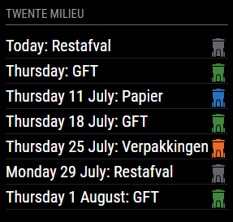

# MMM-TwenteMilieuAfvalwijzer
MagicMirror2 module ripped and mutated from other fellow dutchies

- Gets the upcoming trash days from Twente Milieu based on address
- stores the api responses in local storage for a day before it calls api again



## MagicMirror2 config
```javascript
{
    module: "MMM-TwenteMilieuAfvalwijzer",
    position: "bottom_left",
    config: {
        title:"Twente Milieu",
        numberOfWeeks:7,
        houseNumber:"1",
        postalCode:"7605BG",
        updateInterval: 60 * 1000 // every minute
    }
},
```

STOLEN FROM https://github.com/gertperdZA/MMM-Afvalwijzer
&& https://github.com/Timendus/afvalkalender